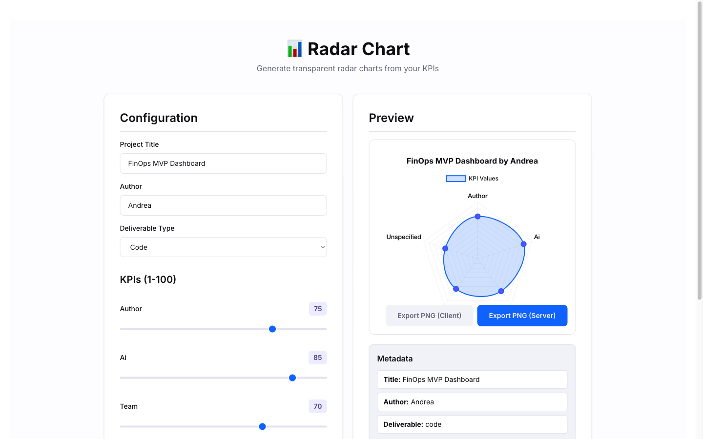
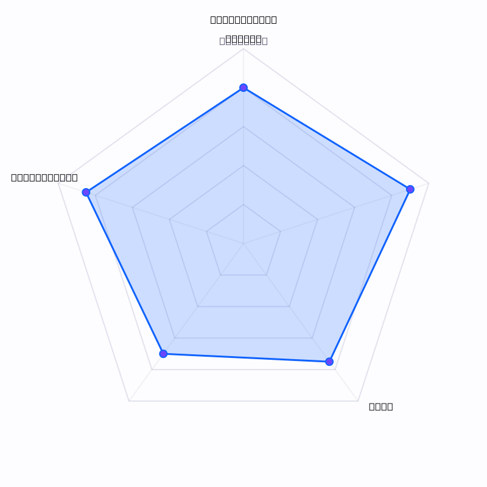

# Stupid Radar Chart App 📊

A simple but effective radar chart generator with transparent PNG export.



## 🚀 Quick Start

### Docker (Recommended)

```bash
# Build image
docker build -t stupid-radar-chart .

# Run container
docker run -p 3000:3000 stupid-radar-chart

# Open http://localhost:3000
```

### Local Development

```bash
npm install
npm run dev
```

Open http://localhost:3000

## 🔧 Features

- **KPI Configuration** — Adjust sliders for 5 KPIs (values 1–100)
- **Real-time Preview** — Chart.js radar chart updates live
- **Client PNG Export** — Instant browser download via `canvas.toDataURL()`
- **Server PNG Export** — SVG → PNG via `sharp` with high-quality rendering
- **Modern Design** — Enterprise Mod 2 glassmorphism theme

## 📊 Supported KPIs

| KPI | Description |
|-----|-------------|
| **Author** | Project authorship |
| **AI** | AI/ML integration level |
| **Team** | System collaboration |
| **Research** | Scientific depth |
| **Unspecified** | Other aspects |

## 🛠️ Stack

- **Frontend:** React + Next.js + Tailwind CSS + Chart.js
- **Server PNG:** sharp (SVG → PNG conversion)
- **No database required**

## 📁 Project Structure

```
app/
  page.tsx                  # Main UI (client component)
  layout.tsx                # Root layout
  globals.css               # Tailwind + custom styles
  styles.css                # Custom slider styles
  api/
    generate-radar/
      route.ts              # Server-side PNG generation
Dockerfile                  # Multi-stage production build
README.md
AGENTS.md
```

## 🎨 Screenshots

### App Interface


### Server-Generated PNG Output


### Full Page View


## 🐛 Troubleshooting

**sharp fails to install?**
```bash
npm install --platform=linux --arch=x64 sharp
```

**Docker build fails?**
Ensure Docker is running and try:
```bash
docker build --no-cache -t stupid-radar-chart .
```

## 📝 License

MIT — Made with ❤️ by Andrea Carmisciano
